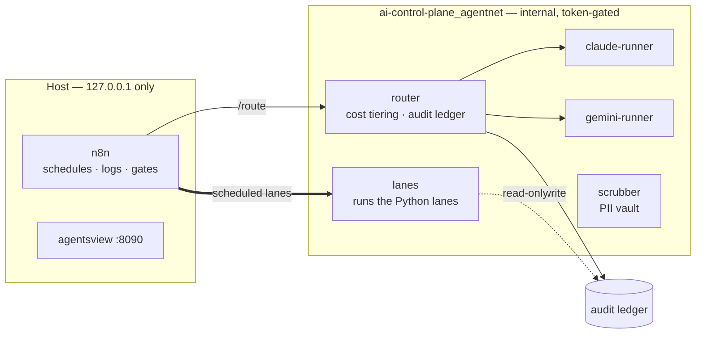

# AI Control Plane

**We believe AI can change how we operate, and let us build things that weren't
possible before.** The potential is enormous - and you reach it with the right
guardrails, processes, and controls in place, not by moving fast and hoping.
Guardrails aren't the brake on ambition. They're what makes ambition safe to
act on.

This is that control plane: a multi-agent orchestration framework where work
flows in through one router, disperses into cost tiers and isolated lanes, and
ships only through verified, human-gated exits. Give AI a single place to act
through, make the rules code, make the boundaries real, and write down every
decision - and the question stops being "is this safe?" and starts being "what
else could we hand it?"

Built on n8n (triggers/routing/glue) + locked-down agent runners that shell out
to vendor CLIs (`claude -p`, `gemini -p`), so model calls bill against **flat
subscriptions/free tiers**, not metered API tokens. Designed rung-by-rung
against the Agentic Development Ladder (see `docs/design/LADDER.md`).

```
                         ┌───────────────────────────┐   ┌─ claude-runner ─┐
                         │          router           │──►│ claude -p (subs)│─► api.anthropic.com
┌────────────┐  /route   │  1. deterministic rules   │   └─────────────────┘
│    n8n     │ ─────────►│  2. cheapest capable tier │   ┌─ gemini-runner ─┐
│ (workflows)│ ◄─────────│  3. maxTier cost ceiling  │──►│ gemini -p (free)│─► *.googleapis.com
└────────────┘  result   │  4. cross-provider verify │   └─────────────────┘
     :5678                └───────────────────────────┘   each runner: firewalled, own auth volume
```
n8n calls the **router**, which enforces cost policy and dispatches to whichever
firewalled runner is cheapest-capable. Each runner talks only to its vendor.

## Live status

Seven services on one private Docker network; only two ports reach the host, both
bound to `127.0.0.1`. **Four scheduled lanes are live.** Everything below is
generated from the running stack by `python scripts/gen_architecture.py`, which
emits two always-current views:

- **[`docs/design/ARCHITECTURE.md`](docs/design/ARCHITECTURE.md)** — topology, mount
  modes, per-service detail (renders on GitHub).
- **[`docs/design/architecture.html`](docs/design/architecture.html)** — a
  self-contained **colorized overview** of components and implementation status
  (open in a browser; theme-aware, no external resources).



n8n cannot run Python (hardened image), so the scheduled Python lanes run in the
`lanes` service and n8n **drives them over HTTP** — schedule, execution log, gates
and notification stay in n8n (see [`docs/decisions/0006`](docs/decisions/0006-python-lanes-run-host-side.md)):

```
schedule → lanes (python) → parse → gate → Notify → Slack
```

| Lane | Schedule | Runs | State |
|---|---|---|---|
| `daily-digest` | daily 07:30 | `lanes /digest` — anomaly-forward digest, heartbeat when quiet | **active** |
| `eval-drift` | Mon 07:00 | `lanes /eval-metrics` — agentic-leverage + drift over the ledger | **active** |
| `retention-sweep` | daily 06:00 | `lanes /retention` — **dry-run only**, no vault, no deletions | **active** |
| `research-watch` | Mon 07:30 | `lanes /research` — release + drift watch over sources tied to a recorded decision; skips the model call on a quiet week | **active** |
| `dispatch` | every 10 min | `lanes /dispatch` — claims ONE ready ticket and hands the handoff to the **router**. Single writer, so the claim is safe without a lease ([ADR 0012](docs/decisions/0012-work-dispatch.md)) | **loaded, not active** |
| `notify`, `approval-gate`, `error-trigger` | on demand | called by the lanes above | loaded |
| `drive-sync`, `deliverables` | every 15 min | Google Drive ↔ scrubbed workspace | needs OAuth |

Every lane has the **Global Error Handler** bound (`settings.errorWorkflow`), so a
failure outside a lane's own guards still reaches a channel. Deploy without UI
clicks: `python scripts/n8n_bootstrap.py --import <file> --activate <id>`.

## What's in here

| Piece | Purpose |
|---|---|
| `QUICKSTART.md` | **Start here** — step-by-step setup, smoke test, workflow wiring, `/route` usage, governance ops, and the pre-production safety checklist. |
| `claude-runner/` | Locked-down runtime: `claude -p` behind a firewall, agent + **verifier** loop with a budget (`server.js`), n8n-MCP for real node schemas. |
| `gemini-runner/` | Second agent, same `/run` contract. Provider-flagged (gemini → antigravity by env). Rides Gemini's free tier. |
| `router/` | **Cost-tiering chokepoint.** Deterministic rules first → cheapest capable model → frontier only where earned. n8n calls this, not the runners. |
| `POST /fanout` (claude-runner) | **AG-2 parallel fan-out** — several agents, each in its own git worktree, each self-verifying; you review diffs, merge by hand. |
| `workspace/CLAUDE.md` | The instruction file — the rules that make Claude build n8n workflows correctly. |
| `n8n-workflows/` | The deployed lanes + reusable sub-workflows: **channel-abstracted Notify** (Slack/Teams/webhook by env), **approval-gate**, the **Global Error Handler**, and the three scheduled lanes above. Stable ids, so cross-references resolve deterministically. |
| `lanes/` + `scripts/n8n_bootstrap.py` | **The Python-lane runner** n8n calls over HTTP (stdlib `http.server`, read-only mounts, fail-closed on `LANES_TOKEN`, no host port), and the CLI that imports/activates workflows **without UI clicks** — deploy-as-code, and it never changes a lane's run state on re-import. |
| `capability-factory/` + [`docs/runbooks/CAPABILITY-FACTORY.md`](docs/runbooks/CAPABILITY-FACTORY.md) | Privileged, on-demand **builder lane**: cli-printing-press generates new CLIs/MCPs when an integration is missing. The directory holds only the Dockerfile — three things reference that path, so it stays; the procedure moved to the runbooks, where every other runbook lives. |
| `agentsview` (service) | Local cost/session **observability** — the telemetry the ladder needs to measure agentic leverage. |
| `docs/design/ARCHITECTURE.md` + `scripts/gen_architecture.py` | **What is actually running** — topology, host exposure, mount modes, and which workflows are loaded in n8n. GENERATED from the live containers (so it refuses to write when the stack is down, and CI cannot check it for staleness). Regenerate after changing the stack. |
| `docs/design/LADDER.md` | How every piece maps to the Agentic Development Ladder and what the next rung needs. **Read this to see the design intent.** |
| `docs/security/THREAT-MODEL.md` | Red-team findings, severity-ranked, with what's fixed vs open. **Read before putting real client data in.** |
| `docs/security/GOVERNANCE.md` | Control catalog — every governance control, how it's enforced, and how to prove it (audit ledger + conformance tests). |
| `docs/security/KILLSWITCH.md` | Kill switch + budget/rate circuit breaker — how a scope or the whole fleet is halted, and the spend-aware breaker that trips on notional cost. |
| `docs/design/EVAL.md` + `scripts/eval_metrics.py` | **Eval / drift lane** — agentic-leverage + quality metrics computed from the audit ledger (continuous eval), trended with drift alerts. Metadata proxy, not a semantic eval. |
| `docs/design/IMPROVEMENT-LOOP.md` + `scripts/eval_run.py` | **Agent improvement loop** — capture a production failure → tokenized regression eval case → offline replay + grade (incl. LLM-as-judge). Governed observability (per-scope, local). The quality counterpart to conformance. |
| `docs/design/NAMING.md` | Agent naming convention (`{Name} the {Role}`, alliterative) + the persona registry. |
| `docs/security/RISK-MODEL.md` | Per-request risk classification (data × access × autonomy) → proportional controls, plus operating mode (who leads / who validates). |
| `docs/plans/ISOLATION-FIX-PLAN.md` + `scripts/gen_compose.py` | The C1/C2 structural-isolation plan and its phase-1 generator (per-scope runner topology). |
| `docs/design/CONTEXT-ARCHITECTURE.md` | Multi-client context sharing/siloing design: firm-wide vs client vs PII layers, isolation options, PII pipeline. |
| `docs/design/AGENT-WORKSPACE.md` + `scripts/workspace_doctor.py` | **Workspace & context layout standard** — where to launch, one workspace vs per-project repos, shared skills without drift, instruction-file budgets, precedence, anti-patterns. The working-set counterpart to `docs/design/CONTEXT-ARCHITECTURE.md`'s walls. The doctor **designs** (`--plan`) and **audits** a tree against it deterministically, with CI exit codes. |
| `docs/design/AGENT-DESIGN.md` + `templates/agents/` | **Agent/persona design standard** — one agent vs split (the contested question, both sides + the checklist), pattern escalation ladder, persona contract (scope / goal / tools / handoff), handoff payload + loop guards, and the MAST failure taxonomy that says which controls actually pay. |
| `context/model-policy.json` + `scripts/model_policy_check.py` | **Model & effort selection per work type**, with the catalog facts (price, context, retirement dates) behind each choice. The checker **fails** when the review date passes, a routed model deprecates, or the two policy files disagree — this is how the standard stays current as models evolve. |
| `context/scopes.json` + `workspace/scopes/` | **Configurable scope hierarchy** (personal→team→department→enterprise or any tree). Router enforces per-level controls: PII guard, ethical walls, silo dispatch. |
| `context/cloud-providers.json` + `scripts/cloud.py` | **Pick a cloud per capability** — transcription, object store, secrets, DLP, model. Google is stubbed; Azure and AWS are declared and **refuse loudly** rather than falling back, because a capability that silently does nothing is worse than one that stops. `--egress` shows exactly which domains a choice opens, since runners are default-deny. `--audit` says plainly that a seam with one implementation is an assumption. |
| `docs/runbooks/GCP-ACCESS.md` | How to give the stack GCP/Gemini/Workspace access **without ever pasting a credential into a chat**. Names the three separate Google relationships the stack has, and which one is currently wrong. |
| `docs/runbooks/GSUITE-GCP.md` | The scope model on Google Workspace + GCP: Groups, Drive sync, Cloud DLP tokenization, VPC-SC, Cloud Run silos. |
| `docs/runbooks/CI-DIAGNOSIS.md` + `scripts/ci_diagnose.py` + `scripts/ci_comment.py` | **The deterministic→model→human loop applied to our own builds.** A red CI run is matched against a table of *confirmed* causes first; an unrecognised failure escalates rather than inventing a cause. The **alert** carries one BLUF line, the **detail** is commented on the PR (or commit) and threaded under the Slack alert — interrupt stays short, detail one click away. **Advise-only by construction:** the diagnostician has no write path at all and the poster writes only comments, because the cheapest way to make CI green is to weaken a check. Every confirmed fix is promoted into a known-cause table — `scripts/ci-known-causes.json` when any repo could hit it (vendored byte-identical, canonical in `ai-standards`), `.ci-known-causes.json` when it is ours — making the second occurrence free. |
| `docs/solutions/` + `scripts/solution.py` | **Problems solved once, written down while the context was fresh.** The known-cause table can only hold what announces itself in a log line; this holds the rest. Its most valuable section is *what was tried that did not work* — the only part nobody can reconstruct later. Shape is gated in CI; the prose deliberately is not. Format borrowed from `EveryInc/compound-engineering-plugin` (MIT), which was itself declined — see [ADR 0014](docs/decisions/0014-solutions-log.md). |
| `docs/runbooks/RCPS-2026-07-26.md` | **Root-cause review of a day's CI failures.** Reads the run history rather than recollection, and the data corrected the recollection twice: 14 red builds were 5 deliberate, 7 from one gate that had *never* passed, and 2 from one sweep. The finding that generalises — a first-run failure and a regression look identical in a run list and need opposite responses. |
| `scrubber/` + `drive-sync` workflow | **Scrubbed ingest gateway**: Drive → PII tokenization → workspace. Token vault mounted only here; runners see tokens, never values. `/rehydrate` restores them post-model. |
| `docs/design/DETECTION-BACKENDS.md` | Pluggable ML detection: optional Presidio/DLP (PII) + Lakera/Bedrock (injection) behind the heuristic default + fail-safe fallback (no new deps). |
| `docs/design/AIOPS.md` + `scripts/eval_metrics.py` | **Cost & benefit instrumentation** — notional cost, tokens, turns and duration per decision in the audit ledger; cost-per-*completed*-task as the headline unit; spend-aware circuit breaker. States plainly that notional cost is a comparable yardstick, not money spent under subscription auth. |
| `docs/decisions/` + `scripts/adr_check.py` | **Decision records** (`0001`–`0012`): context compression, PII/secret scanning, Slack integration, human-awareness observability, secrets management, and Python-lanes-run-in-`lanes`. Each `Considered` table carries a **Cost column** — `adr_check.py` fails CI if one is missing (cost weighed at decision time, not invoice time). `TEMPLATE.md` is the starting point. |

## Setup

> **▶ New here? Run the installer:** `python scripts/install.py` (or `./install.sh`
> / `.\install.ps1`) prompts for the big decisions, writes the config, and can
> build + start. Full runbook: **[QUICKSTART.md](QUICKSTART.md)** (setup → smoke
> test → workflows → `/route` usage → governance ops → pre-production checklist).
> The steps below are the short form.

1. **Prereqs:** Docker Desktop (WSL2 backend on Windows).

   ⚠️ **Scheduled lanes need the engine to actually be running, and it is easy to
   be wrong about that.** Running `dockerd` inside a hand-started WSL distro looks
   identical while you have a terminal open — and the distro *terminates when the
   last session closes*, taking every container with it. n8n does not backfill
   missed crons, so lanes marked "active" simply never fire. Use Docker Desktop
   with **Settings → General → "Start Docker Desktop when you sign in"** enabled,
   and schedule lanes for hours the machine is realistically on. Even then,
   availability is bounded by being signed in — see
   [ADR 0009](docs/decisions/0009-where-the-control-plane-runs.md) for the
   always-on option and the triggers that should force it.

2. **Secrets:** copy `.env.example` to `.env` and set **three distinct** random
   tokens — `RUNNER_TOKEN`, `ROUTER_TOKEN`, `SCRUBBER_TOKEN` (`openssl rand -hex
   32` each). Services **refuse to start** without them (fail-closed;
   `ALLOW_NO_AUTH=1` for local dev only). In each workflow HTTP node send the
   token matching the target: `/route`→`ROUTER_TOKEN`, `/run`+`/fanout`→
   `RUNNER_TOKEN`, `scrubber/*`→`SCRUBBER_TOKEN`. See [THREAT-MODEL.md](docs/security/THREAT-MODEL.md).

   **Also:** n8n binds to `127.0.0.1` only (not the LAN) — complete n8n's
   owner-account setup on first launch so the UI isn't open to other local users.

3. **Build:**
   ```sh
   docker compose build
   ```

4. **Log in once (the fiddly part — see below):**
   ```sh
   docker compose run --rm claude-runner claude login
   docker compose run --rm gemini-runner gemini        # then /auth (Google login)
   ```
   Follow each OAuth prompt. Tokens land in the `claude-config` / `gemini-config`
   volumes and persist across restarts. (Same headless-container OAuth caveat for
   both — see below.) Skip the Gemini login if you're only using Claude.

5. **Start:**
   ```sh
   docker compose up -d          # runner + n8n + agentsview
   ```
   - n8n UI → http://localhost:5678
   - agentsview (cost/session dashboard) → http://localhost:8090
   - The `claude-builder` capability lane is **off by default**; start it only
     when generating a new integration:
     `docker compose --profile builder run --rm claude-builder` (see
     [`docs/runbooks/CAPABILITY-FACTORY.md`](docs/runbooks/CAPABILITY-FACTORY.md)).

   Pick your alert channel in `.env`: set `NOTIFY_CHANNEL` to `slack`, `teams`,
   or `webhook` and fill the matching `*_WEBHOOK_URL` (see
   `n8n-workflows/README.md`).

   For a verified run, POST with `verify:true` and a `goal` — the runner adds a
   separate clean-context reviewer and returns a pass/fail `verdict` alongside
   the result.

6. **Smoke test the runner directly** (from another container or by temporarily
   publishing the port):
   ```sh
   docker compose exec n8n sh -c \
     'wget -qO- --header="x-runner-token: <your-token>" \
       --post-data="{\"prompt\":\"say hi\"}" \
       --header="content-type: application/json" \
       http://claude-runner:8080/run'
   ```

7. **Import the workflow:** in n8n (http://localhost:5678) → import
   `n8n-workflow.example.json`. Fix the token in the HTTP Request node, run it.
   The model's text is in `result` of the response JSON.

## The login caveat (read this)

Getting subscription credentials into a headless Linux container is the one
genuinely awkward step:

- `claude login` uses an OAuth browser flow. In a container the localhost
  callback can't reach your host browser directly. Use the code/paste flow if
  the CLI offers it, or open the printed URL on your host and complete it there.
- Alternatively, if your host already has a login token as a **file** (Linux/WSL
  keeps it at `~/.claude/.credentials.json`), you can copy that into the
  `claude-config` volume instead of logging in inside the container. On native
  Windows/macOS the token may live in the OS keychain rather than a file, in
  which case the in-container login is the reliable path.

## Firewall notes

- `init-firewall.sh` default-denies egress and allows only the domains listed at
  the top. Add your own there (private registry, git host, any API your agent
  calls).
- IPs are resolved once at container start via `ipset`. Anthropic sits behind a
  CDN whose IPs can rotate; if calls start failing after a long uptime, restart
  the container to re-resolve, or widen the allowlist.
- Requires `cap_add: NET_ADMIN` (already in the compose file). Set
  `FIREWALL=off` to disable while debugging.

## Best practices baked in (from the community research)

The recurring failure mode for AI-built n8n workflows is Claude **guessing node
configs** and getting them half wrong. This setup addresses that directly:

- **n8n-MCP server** (`claude-runner/.mcp.json`) — Claude reads *real* node
  schemas via `search_nodes`/`get_node` and validates with
  `validate_node`/`validate_workflow` before deploying, instead of inventing
  params. Baked into the image so it works behind the firewall.
- **`workspace/CLAUDE.md`** — the instruction file *is* the product. It encodes
  the rules below and, crucially, contains no contradictions (the most common
  cause of an agent that stalls and second-guesses). Edit it as you learn your
  own patterns; keep it internally consistent.
- **Rules it enforces:** set every param explicitly (defaults are the #1 runtime
  failure); validate in stages (minimal → full → workflow); build happy-path
  first then add error handling; three-layer error handling (node retries +
  global Error Trigger + explicit data-quality checks); defensive expressions
  (`?.`, `??`, `.trim()`, `Number()`); production read-only, changes on staging.
- **Git-versioned workflows** — Claude exports workflow JSON into `./workspace`,
  which you commit and diff. (Credentials never transfer in the JSON, by design.)

### Enabling write access to n8n (optional)

By default n8n-mcp runs in **docs + validation-only** mode — Claude can read
schemas and validate, but not touch your instance. To let it create/update/run
workflows:

1. In n8n → **Settings → n8n API → Create an API key** (scope it; don't hand it
   production if you only need staging).
2. Put it in `.env` as `N8N_API_KEY`, and set
   `N8N_API_URL=http://n8n:5678/api/v1`.
3. `docker compose up -d` to restart the runner.

Keep it read-only against production and execute-only against dev/staging — the
community's hard-won rule is "you don't want Claude triggering production."

### Debugging what Claude builds (you still own this)

AI JSON is scaffolding, not a finished product. When something breaks, debug it
the normal n8n way: **Execute Node** step-by-step, **pin** sample data so
downstream nodes stay stable, inspect each node's output in the execution view,
check credentials (they never import with the JSON), and watch for node-version
differences between instances. Note: the Error Trigger only fires on *production*
executions (webhook/schedule/called), never on manual "Execute Workflow" runs.

## Supply-chain security

An agent framework runs other people's code by design, so what it pulls and what
it builds both matter. Two halves, because either alone leaves a hole: **scanners
tell you something is vulnerable; Dependabot opens the PR that fixes it.**

| Control | Covers | Cadence |
|---|---|---|
| `scripts/image_policy_check.py` | **static** — are images digest-pinned, and have the pins been reviewed? | every push |
| Trivy config scan | Dockerfile misconfiguration (root user, secrets in build args) | daily + on relevant path change |
| Trivy — pinned third-party images | what upstream ships in the images we pull and cannot fix, only upgrade | daily |
| Trivy — **built images** | what our Dockerfiles install on top: `lanes`, `router`, `scrubber`, `claude-runner`, `gemini-runner`, and the privileged `capability-factory` builder | daily |
| Dependabot | declared npm deps in each runner, plus Docker and GitHub Actions | daily |

**Scanning the images we RUN, not just the ones we pull**, is the one worth
calling out. Base-image and declared-dependency coverage sounds complete and is
not: the agent CLIs are installed in our own final layers, so a scan that stops at
the base image misses precisely the layer an agent framework can least afford to
leave unscanned. Building in CI is also the only thing that proves the Dockerfiles
still build — which is not theoretical, since adding digest pins once left every
image unbuildable for a day, invisible because no job built one.

**Daily, not weekly.** The 2026 pattern is CVEs exploited within roughly 36 hours
of disclosure, so a seven-day loop can leave a known-exploited flaw live for six of
them. The image scan is the expensive job (~10-15 CI minutes/day); if that becomes
a constraint, add a buildx layer cache before reducing the frequency.

**Trivy is invoked as a pinned image, not a marketplace action** — that removes a
third-party Action from a security-critical pipeline, and pins the scanner the way
everything else is pinned. Safe, because Trivy fetches its vulnerability database
at run time, so a pinned binary still sees fresh CVEs.

### What this does not cover

- **`--ignore-unfixed`, deliberately.** A CRITICAL with no available patch is a
  risk to record and revisit, not a build to block on forever. It also means an
  unpatchable critical will not fail the scan — it has to be tracked by a human.
- **CRITICAL only for images** (config misconfiguration blocks at CRITICAL and
  HIGH). A HIGH inside a running image does not fail the build.
- **Exceptions are live risk.** `.trivyignore` currently carries one, with the
  reasoning and the revisit trigger written next to it. An entry there is a
  decision, not a silencing — it stays only while its justification holds.
- **No runtime behavioural monitoring.** Everything here is build- and
  pull-time. Nothing watches what a container does once it is running.
- **Lockfile integrity is not separately verified** beyond what Dependabot's
  graph sees.

## Cost controls (tiering)

Route through `router` (`POST /route`) instead of a runner and you get three cost
rules enforced automatically (full detail in [router/README.md](router/README.md)):

1. **Deterministic first** — `router/rules.js` answers well-defined tasks with
   regex/lookups/templates at **zero LLM cost**. Encode your high-frequency cases.
2. **Cheapest capable model** — `task_type` → tier in `router/policy.json`; the
   router always picks the lowest tier that fits (Gemini Flash-Lite → Sonnet →
   Fable). Omit `task_type` and it triages with a cheap model first.
3. **Frontier only where earned** — `plan`/`architect`/`test-design`/`review` get
   the frontier tier; a hard **`maxTier`** ceiling blocks frontier spend in
   automation lanes unless a call passes `allowFrontier:true`.

Every response includes a `decision` block (tier, model, why) as an audit trail;
pair it with agentsview for actual spend. Cross-verify runs the reviewer on the
*other* provider, splitting that cost across both free/subscription lanes.

## Billing reality check

- Flat subscription rate — great for personal automation and dev-time agents.
- Subscription usage limits are sized for interactive coding; a high-volume n8n
  flow firing many `claude -p` calls will hit those caps. For production traffic,
  switch the runner to an API key (and accept metered billing).

---

Built and maintained by **JGOBuilds**. Copyright © 2026 Brightside Data LLC —
[brightsidedata.co](https://brightsidedata.co). Licensed AGPL-3.0-or-later; see
`NOTICE` for what that does and does not cover in the wider stack.
