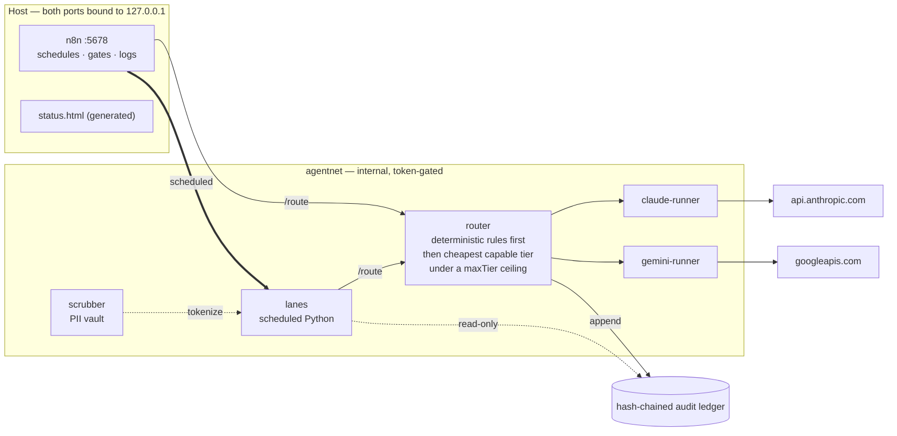

# AI Control Plane

**A governance layer for agent work.** Agents enter through one router, disperse
into cost tiers and isolated scopes, and ship only through verified, human-gated
exits. Built for the case where you need to hand real work to agents and still be
able to say what they did, why, and on whose behalf.

Runs on Docker + n8n. Firewalled runners shell out to vendor CLIs (`claude -p`,
`gemini -p`); the router decides which one, at what cost tier, under what policy.

**AGPL-3.0-or-later · brand- and vendor-neutral · [QUICKSTART](QUICKSTART.md) ·
[Generated docs ↗](https://jgobuilds.github.io/ai-control-plane-public/)**

> ### 🚧 Under construction — read this before evaluating it
>
> This is **actively being built**, with features tested and rolled out
> iteratively. Some lanes run daily on real work; others are loaded but have
> never executed once. Treat it as a system being assembled in the open, not a
> finished product.
>
> **Nothing here is dressed up as more complete than it is.** The status table
> below marks each lane's real state, the known gaps are filed as public issues
> rather than buried in prose, and where something is a stated intent rather
> than a working control — the retention sweep deletes nothing today — it says
> so at the point you would otherwise assume otherwise.
>
> If you are deciding whether to depend on this: don't yet. If you are deciding
> whether the approach is sound, that is what it is here to show.

Everything reaches a runner through the **router** and nowhere else, so cost
policy, scope enforcement and the audit record all have exactly one place to
live. Each runner is firewalled to its own vendor; the PII vault inside the
scrubber is never mounted into one.

## What's unusual here

Most of this repo is the boring half of agentic work, which is the half that
decides whether you can trust the interesting half.

- **One chokepoint.** n8n calls the router; the router calls the runners. Nothing
  else reaches a runner, so policy has exactly one place to live.
- **Deterministic before models.** `router/rules.js` answers well-defined tasks
  with rules at zero model cost. A model is the fallback, not the default.
- **Every decision is appended to a hash-chained ledger.** There is no path that
  acts without leaving a record.
- **Runners are firewalled** and reach only their own vendor. The PII vault is
  never mounted into one.
- **Every decision record carries a Cost column, and CI rejects one that doesn't**
  — because a comparison without cost gets decided on architecture and paid for
  later. It changes answers:
  [ADR 0009](docs/decisions/0009-where-the-control-plane-runs.md) is why this runs
  on Docker on a desktop instead of Kubernetes, and
  [ADR 0010](docs/decisions/0010-agent-work-management.md) is why the task record
  was built rather than adopting a durable-execution engine.
- **The gates block their own authors.** A staged-scope check refuses to commit
  another writer's in-flight work; it has stopped the person who wrote it.
- **Failures become data.** CI failures are matched against known-cause
  signatures deterministically, before any model is asked; a model is consulted
  only for what no signature catches, and what it concludes is written back as a
  new signature. See [`docs/runbooks/CI-DIAGNOSIS.md`](docs/runbooks/CI-DIAGNOSIS.md).

## Status — what actually runs

**Maturity, self-assessed 2026-09-24: enforced, thinly exercised.** Policy
enforcement, auditability and supply-chain safety sit at **4 of 5** (a gate that
has been watched failing, with the proof re-run automatically); isolation,
reliability, cost, compliance evidence and security posture at **3**; quality
eval and autonomy at **2**. Level 5 needs real volume and an outside reviewer,
so nothing here claims it. Per-dimension evidence, the ramp and how to disprove
any row: [`docs/design/MATURITY.md`](docs/design/MATURITY.md).

Seven services on one private Docker network — the diagram above. The
authoritative component detail is
[`docs/design/ARCHITECTURE.md`](docs/design/ARCHITECTURE.md), **generated from the
running stack** by `scripts/gen_architecture.py`, which refuses to write when the
stack is down so it cannot describe a system that isn't there. The diagram above
is drawn by hand and can drift from it; the generated file wins.

| Lane | Schedule | Runs | State |
|---|---|---|---|
| `daily-digest` | daily 07:30 | `lanes /digest` — anomaly-forward digest, heartbeat when quiet | **active** |
| `eval-drift` | Mon 07:00 | `lanes /eval-metrics` — agentic-leverage + drift over the ledger | **active** |
| `retention-sweep` | daily 06:00 | `lanes /retention` — **dry-run only**, no vault, no deletions | **active** |
| `research-watch` | Mon 07:30 | `lanes /research` — release + drift watch over sources tied to a recorded decision; skips the model call on a quiet week | **active** |
| `dispatch` | every 10 min | `lanes /dispatch` — claims ONE ready ticket and hands the handoff to the **router**. Single writer, so the claim is safe without a lease ([ADR 0012](docs/decisions/0012-work-dispatch.md)) | **active, never carried real work** |
| `notify`, `approval-gate`, `error-trigger` | on demand | called by the lanes above | loaded |
| `drive-sync`, `deliverables` | every 15 min | Google Drive ↔ scrubbed workspace | needs OAuth |

Every lane has the Global Error Handler bound, so a failure outside a lane's
own guards still reaches a channel.

**The gaps are filed as issues, not footnotes**, because a README that only lists
wins is not evidence of anything — and a gap you can subscribe to is a different
commitment from a gap in a paragraph:

| Gap | |
|---|---|
| `drive-sync` has **never run** — needs Drive OAuth | [#3](https://github.com/jgobuilds/ai-control-plane-public/issues/3) |
| Retention sweep is **dry-run only** — it deletes nothing, which gates anything holding tenant data | [#4](https://github.com/jgobuilds/ai-control-plane-public/issues/4) |
| `dispatch` fires on schedule but has **never claimed a real ticket** | [#5](https://github.com/jgobuilds/ai-control-plane-public/issues/5) |
| `gemini-runner` runs on free-tier consumer terms while the data-handling record assumes Workspace | [#6](https://github.com/jgobuilds/ai-control-plane-public/issues/6) |

The last one is the shape worth studying: nothing is broken, nothing fails, and
every document reads as consistent — because both arrangements are called
"Google". CI cannot catch it, since which contract governs an API key is not
observable from the call.

## Finding your way around

| Start here | For |
|---|---|
| [`docs/overview.html`](docs/overview.html) | the one-page overview — request path, operating rules, review lenses, what runs today. Also the landing page of the [docs site](https://jgobuilds.github.io/ai-control-plane-public/) |
| [`QUICKSTART.md`](QUICKSTART.md) | setup, smoke test, first `/route` call, the login caveat |
| [`docs/design/MATURITY.md`](docs/design/MATURITY.md) | **where this actually is** — a self-assessed rating per dimension (1–5), the ramp that moves each one, and the command behind every row |
| [`docs/design/LADDER.md`](docs/design/LADDER.md) | the design intent, rung by rung — **and how the harness changes from one laptop to a cloud deployment**, including CLI licensing |
| [`docs/design/CONTEXT-ARCHITECTURE.md`](docs/design/CONTEXT-ARCHITECTURE.md) | sharing vs siloing: three layers over a tenant axis you choose (department, counterparty, deal team, customer) |
| [`docs/decisions/`](docs/decisions/) | why things are the way they are — including the options that lost, and what each would have cost |
| [`docs/security/THREAT-MODEL.md`](docs/security/THREAT-MODEL.md) | red-team findings, severity-ranked, fixed vs still open |
| [`docs/security/GOVERNANCE.md`](docs/security/GOVERNANCE.md) | the control catalog, and how to prove each control |
| [`docs/runbooks/`](docs/runbooks/) | operating it: CI diagnosis, GCP access, capability factory, testing |
| [`docs/solutions/`](docs/solutions/) | problems solved once, written down while the context was fresh |
| [`router/README.md`](router/README.md) | the tiering rules and the `decision` block |
| [`docs/design/STATUS-VIEW.md`](docs/design/STATUS-VIEW.md) | the one-page operational view — gates, containers, lanes, ledger, agent sessions |
| [`docs/design/RECURRENCE.md`](docs/design/RECURRENCE.md) | seen once fix it, seen twice fix the harness — the register that makes "this keeps failing" a number |

Component detail — every service, mount mode and lane — is in
[`docs/design/ARCHITECTURE.md`](docs/design/ARCHITECTURE.md), generated from the
live stack rather than maintained by hand.

## Cost controls

Route through `POST /route` rather than a runner and three rules apply
automatically (detail in [`router/README.md`](router/README.md)):

1. **Deterministic first** — rules answer high-frequency cases at zero model cost.
2. **Cheapest capable model** — `task_type` → tier; the router picks the lowest
   tier that fits, and triages with a cheap model when you omit it.
3. **Frontier only where earned** — a hard `maxTier` ceiling blocks frontier spend
   in automation lanes unless a call passes `allowFrontier: true`.

Every response carries a `decision` block (tier, model, why). Cross-verification
runs the reviewer on the *other* provider.

> **On billing — read this before planning around it.** Running through the CLIs
> is *not* a cost moat. Since **2026-06-15**, headless `claude -p` on a Claude
> subscription no longer draws on plan usage limits: it draws on a per-user
> **monthly Agent SDK credit** ($20 Pro · $100 Max 5x · $200 Max 20x) at standard
> API rates, and when the credit runs out, requests **stop** unless usage credits
> are enabled. That is Anthropic's Help Center, quoted and re-checked 2026-09-19.
> So unattended volume is a real, capped cost line — and a vendor policy, not a
> property of this design: the router picks the tier, so a terms change moves
> cost, not architecture. This paragraph has been wrong in both directions
> before, each time from secondary sources; `scripts/claims_check.py` now fails
> CI if the retracted version comes back. Gemini's free tier also carries
> **different data-handling terms** than a paid or enterprise tier, which for
> anything sensitive matters more than the price. **Verify against current vendor
> terms rather than this sentence** — the full matrix, with dates, sources and
> confidence per provider, is in
> [`docs/design/PROVIDER-BILLING.md`](docs/design/PROVIDER-BILLING.md). See [`docs/design/LADDER.md`](docs/design/LADDER.md#licensing-the-agent-clis--check-this-before-scaling-anything).

> **Cost is a yardstick here, not a spend figure.** The ledger records *notional*
> cost so lanes can be compared; what you are actually billed depends on your
> vendor plan. See the billing note above before planning around either.

## Supply-chain security

An agent framework runs other people's code by design, so what it pulls and what
it builds both matter. Scanners tell you something is vulnerable; Dependabot opens
the PR that fixes it — neither alone is enough.

| Control | Covers | Cadence |
|---|---|---|
| `scripts/image_policy_check.py` | **static** — are images digest-pinned, and have the pins been reviewed? | every push |
| Trivy config scan | Dockerfile misconfiguration (root user, secrets in build args) | daily + on relevant path change |
| Trivy — pinned third-party images | what upstream ships in the images we pull and cannot fix, only upgrade | daily |
| Trivy — **built images** | what our Dockerfiles install on top: `lanes`, `router`, `scrubber`, `claude-runner`, `gemini-runner`, and the privileged `capability-factory` builder | daily |
| Dependabot | declared npm deps in each runner, plus Docker and GitHub Actions | daily |

**Scanning the images we RUN, not just the ones we pull**, is the one worth
calling out. Base-image and declared-dependency coverage sounds complete and is
not: the agent CLIs are installed in our own final layers, so a scan that stops at
the base image misses precisely the layer an agent framework can least afford to
leave unscanned. Building in CI is also the only thing that proves the Dockerfiles
still build — which is not theoretical, since adding digest pins once left every
image unbuildable for a day, invisible because no job built one.

**Daily, not weekly.** The 2026 pattern is CVEs exploited within roughly 36 hours
of disclosure, so a seven-day loop can leave a known-exploited flaw live for six of
them. The image scan is the expensive job (~10-15 CI minutes/day); if that becomes
a constraint, add a buildx layer cache before reducing the frequency.

**Trivy is invoked as a pinned image, not a marketplace action** — that removes a
third-party Action from a security-critical pipeline, and pins the scanner the way
everything else is pinned. Safe, because Trivy fetches its vulnerability database
at run time, so a pinned binary still sees fresh CVEs.

### What this does not cover

- **`--ignore-unfixed`, deliberately.** A CRITICAL with no available patch is a
  risk to record and revisit, not a build to block on forever. It also means an
  unpatchable critical will not fail the scan — it has to be tracked by a human.
- **CRITICAL only for images** (config misconfiguration blocks at CRITICAL and
  HIGH). A HIGH inside a running image does not fail the build.
- **Exceptions are live risk.** `.trivyignore` currently carries one, with the
  reasoning and the revisit trigger written next to it. An entry there is a
  decision, not a silencing — it stays only while its justification holds.
- **No runtime behavioural monitoring.** Everything here is build- and
  pull-time. Nothing watches what a container does once it is running.
- **Lockfile integrity is not separately verified** beyond what Dependabot's
  graph sees.

---

Built and maintained by **JGOBuilds**. Copyright © 2026 Brightside Data LLC —
[brightsidedata.co](https://brightsidedata.co). Licensed AGPL-3.0-or-later; see
`NOTICE` for what that does and does not cover in the wider stack.
