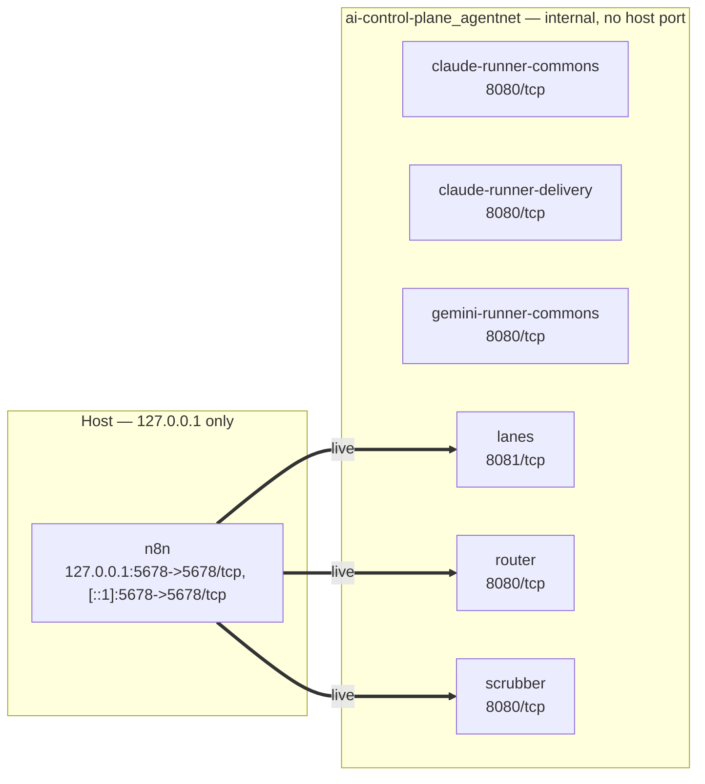

# Architecture — live stack

> GENERATED by `scripts/gen_architecture.py` from the **running containers**
> — **do not edit by hand**. Regenerate: `python scripts/gen_architecture.py`.
> Generated 2026-08-31 06:51.

Unlike the compliance map and use-case register, this is generated from live
infrastructure rather than committed files, so **CI cannot check it for
staleness** — there is no docker daemon in CI. Judge freshness by the stamp
above and regenerate after changing the stack.

## Topology

Nodes, ports and mounts are **discovered** from the running containers.
Thick arrows are **live** call paths — a workflow that is actually loaded in
n8n references that service. Dotted `available` arrows come from workflow
files in the repo that are **not loaded**, so they are not call paths today.
Dotted token arrows are **authored**: the router's fan-out lives in router
policy, which docker does not expose.

## Services

| Service | Image | Ports | Reachable from host |
|---|---|---|---|
| `claude-runner-commons` | `ai-control-plane-claude-runner-commons` | `8080/tcp` | no |
| `claude-runner-delivery` | `ai-control-plane-claude-runner-delivery` | `8080/tcp` | no |
| `gemini-runner-commons` | `ai-control-plane-gemini-runner-commons` | `8080/tcp` | no |
| `lanes` | `ai-control-plane-lanes:latest` | `8081/tcp` | no |
| `n8n` | `a9e2e3c8006e` | `127.0.0.1:5678->5678/tcp, [::1]:5678->5678/tcp` | **yes** (localhost only) |
| `router` | `ai-control-plane-router` | `8080/tcp` | no |
| `scrubber` | `ai-control-plane-scrubber` | `8080/tcp` | no |

## What each service can touch

| Service | Path | Mode |
|---|---|---|
| `n8n` | `_data → /home/node/.n8n` | `rw\n` |

## Loaded in n8n

| Workflow id | Name | State |
|---|---|---|
| `aicp-approval-gate` | Approval gate (reusable) | **active** |
| `aicp-ask-question` | Ask a human (agent question gate) | **active** |
| `aicp-ask-webhook` | Ask a human (HTTP door for the runner) | **active** |
| `aicp-daily-digest` | Daily digest lane (scheduled, human-awareness digest tier) | **active** |
| `aicp-dispatch` | dispatch | **active** |
| `aicp-error-trigger` | Global Error Handler | **active** |
| `aicp-eval-drift` | Eval / drift lane (scheduled, AG-3) | **active** |
| `aicp-notify` | Notify (channel-abstracted) | **active** |
| `aicp-research-watch` | Research watch (scheduled) | **active** |
| `aicp-retention-sweep` | Retention sweep (scheduled lane) | **active** |
| `aicp-seam-heartbeat` | Seam heartbeat (ask-human door) | **active** |
| `aicp-recurrence-review` | Recurrence review (scheduled) | **active** |
| `aicp-deliverables` | Deliverables → Drive (rehydrated) | idle |
| `aicp-dependency-bumps` | Dependency bumps (scheduled lane, AG-3) | idle |
| `aicp-drive-sync` | Drive → workspace sync (scrubbed) | idle |
| `aicp-feedback` | Feedback → eval inbox (thumbs-down capture, SCAFFOLD) | idle |
| `aicp-incident-responder` | Incident responder (event-driven skills, AG-3) | idle |
| `aicp-promote-skill` | Promote skill (scrub → review → commit) | idle |

**18 of 18** non-example workflow files are loaded.

## Why the Python lanes are not run by n8n

n8n's image is a hardened image with no package manager and no python, and
no other service in the stack has one. Lanes that must be n8n-driven expose
an HTTP endpoint that n8n calls — see
[0006-python-lanes-run-host-side.md](../decisions/0006-python-lanes-run-host-side.md).

